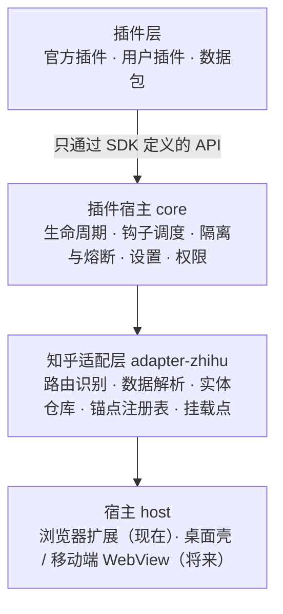
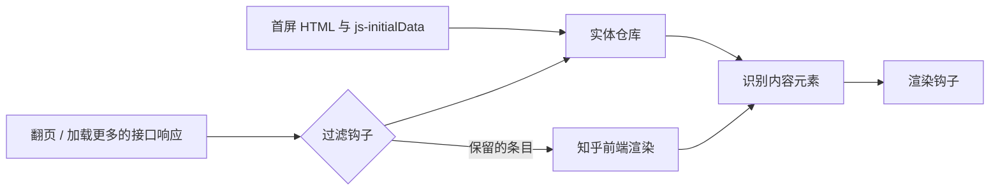

# zhihu-browser 项目计划（草案 v0.1）

> **状态**：草案，等待评审 · **更新**：2026-09-28
> 仓库暂名 `zhihu-browser`，正式名称上架前再定（见[第 11 节](#11-决定记录)）。
> 配套文档：[插件 API 草案](./plugin-api.md)

## 1. 这是什么

一个开源的知乎浏览增强工具，以浏览器扩展的形式运行在 Chrome、Edge 和 Firefox 上。用户照常在知乎官方网页登录和浏览，扩展在此基础上提供屏蔽、主题、阅读模式、快捷键等功能。

核心理念来自 [pi](https://github.com/badlogic/pi-mono)：**核心小而稳定，其余一切都是插件**。内置功能和第三方插件使用同一套 API；用户可以安装插件、切换主题，也可以自己写插件，或者让 AI 帮忙写。

> 想要"专用浏览器"的体验：在 Chrome / Edge 中把知乎"安装为应用"，就能得到独立窗口和任务栏图标，扩展在其中照常生效。

## 2. 目标与非目标

### 2.1 目标

1. **更好的阅读体验**：在知乎官方页面上提供屏蔽、主题、阅读模式、快捷键等增强。
2. **稳定**：知乎改版时只需修复适配层，插件不受影响；适配失效时宁可"不增强"，也不能"把页面搞坏"。
3. **可扩展**：插件能满足绝大多数定制需求，加功能不需要改核心。
4. **人人能写插件**：从零代码配置、单文件插件到完整插件包；API 小、有类型、文档齐全，AI 读完就能写对。
5. **安全可信**：开源、最小权限、零遥测、不接触账号密码。

### 2.2 非目标（不做清单）

以下内容不在本项目范围内；其中涉及插件行为的几条，同样写入插件审核标准：

- 独立浏览器或桌面客户端（M4 之前不考虑，见 [5.9](#59-将来更换宿主)）。
- 用知乎私有接口重写整个前端；逆向或伪造接口签名（如 `x-zse-96`）。
- 对知乎的写操作：点赞、关注、评论、私信、发布等，以及任何批量或自动化操作。
- 批量爬取、批量导出他人内容。
- 绕过盐选或其他付费内容的限制。
- 遥测、账号体系、自建服务器。

## 3. 关键决策

| 决策 | 选择 | 理由 |
|---|---|---|
| 产品形态 | 浏览器扩展（Manifest V3） | 独立浏览器与扩展的核心难点相同（适配知乎）；扩展不用维护浏览器内核，还能直接用浏览器里已登录的知乎 |
| 首发平台 | Chrome / Edge，M2 起支持 Firefox | Chromium 内核用户最多 |
| 最低版本 | Chrome 138+（Edge 待 M0 核实） | 统一"允许用户脚本"开关的引导，并支持每个插件独立的运行环境 |
| 插件哲学 | pi 式小核心 | 核心只做插件做不了的事；官方功能也写成插件 |
| 数据来源 | 页面首屏数据 + 知乎前端自己发出的接口请求的响应 | 拿到结构化数据，但不主动请求知乎、不逆向签名 |
| 扩展点 | 三级：过滤 > 渲染钩子 > 原始 DOM | 越靠前越稳定，见 [5.4](#54-知乎适配层) |
| 第三方代码插件 | 通过 `chrome.userScripts` 运行（M2） | 商店禁止扩展执行远程代码，这是浏览器提供的正规通道 |
| 写操作 | 核心不提供 | 避免自动化带来的封号风险和滥用 |
| 技术栈 | WXT + TypeScript + Preact + pnpm | 见 [8.1](#81-技术栈) |

## 4. 设计原则

1. **核心小而稳。** 核心只包含插件宿主、知乎适配层、基础界面组件、设置与存储、权限。新增 API 至少要有两个真实插件需要它。
2. **自己用自己的 API。** 官方插件与第三方插件使用完全相同的 API；官方插件同时充当 API 的回归测试。
3. **稳定性分级且明示。** 每个 API 标注 `stable` / `experimental` / `unstable`；只用 `stable` API 的插件在插件列表中标为"稳定"。
4. **数据可序列化。** 插件拿到的都是普通 JSON 对象，不暴露知乎的内部对象。这是跨运行环境通信的前提，也为将来更换宿主留好了路。
5. **出错时放行。** 适配失效、插件报错或超时，只影响增强功能本身；知乎页面照常可用，内容不会被误删。
6. **用户掌控。** 最小权限、零遥测、源码透明、一键安全模式。
7. **文档先行，对 AI 友好。** API 的设计标准是"模型读完文档就能写对插件"。

## 5. 架构

### 5.1 分层



- **sdk**：插件 API 的类型定义和开发工具，对外发布，是插件与核心之间的契约。
- **core**：插件宿主，与知乎无关、与宿主环境无关。
- **adapter-zhihu**：把知乎多变的页面和数据翻译成稳定的语义事件。**知乎改版只修这一层。**
- **host**：具体的运行环境，目前只有浏览器扩展（`apps/extension`）。

### 5.2 运行环境

MV3 扩展的代码分布在几个相互隔离的环境里：

| 环境 | 运行什么 | 说明 |
|---|---|---|
| 页面主环境（MAIN world） | 网络拦截、路由监听 | 与知乎页面脚本共享 JS 环境；只放最少的代码，不运行任何插件 |
| 扩展隔离环境（ISOLATED world） | 插件宿主、适配层、官方插件 | 核心所在，可以使用扩展 API |
| 用户脚本环境（USER_SCRIPT world） | 用户插件 + SDK 运行时 | M2 引入；每个插件一个独立环境（`worldId`） |
| 后台（Service Worker） | 插件安装与更新、存储、`z.fetch` 网络代理、权限管理 | 页面不可见 |
| 扩展页面 | 设置页、插件管理、插件编辑器 | |

环境之间的通信分两类：

- **页面数据**（知乎内容、渲染事件）通过 DOM 自定义事件传递：同步、JSON 序列化。页面脚本理论上看得到这些事件，但传的本来就是页面上的公开数据。
- **私有能力**（设置、存储、网络、权限）通过扩展消息通道，页面看不到。

后台 service worker 可能被浏览器回收，M0 中冷启动时一次消息往返最长约 0.3 秒，所以后台不能放在关键路径上：用户插件启动时需要的设置随注册代码一起注入（设置变化时更新注册），官方插件在 ISOLATED world 里直接读 `chrome.storage`。

### 5.3 数据流



1. **首屏**：解析页面里的 `js-initialData`（知乎的首屏数据），写入实体仓库。M0 发现首屏分两种情况：
   - 首页推荐的首屏内容**不在**首屏数据里，而是前端启动后用接口加载的，按第 2 步处理即可；
   - 回答页等服务端渲染的页面，内容已经在 HTML 里，被过滤的条目只能在渲染后隐藏。为了不闪烁，由扩展注入预隐藏样式（不受页面 CSP 限制），先隐藏尚未处理的内容卡片，处理完立即显示；设置超时，超时后一律显示。M0 中预隐藏在回答页上 18–47 ms 内就处理完。M0 也确认：虽然每次都能在知乎前端启动前改写首屏数据，但删掉其中的回答后页面照样显示它（前端还会再请求一次），所以**不采用"改写首屏数据"的做法**。
2. **后续加载**：在 MAIN world 拦截知乎前端自己发出的 `fetch` / XHR 请求的响应（请求本身不改，签名由知乎自己完成），运行过滤钩子删掉不需要的条目，再交给知乎前端渲染，不会出现"先显示再隐藏"。
3. **识别**：知乎渲染完成后，适配层用锚点注册表找出每一块内容，关联到实体仓库中的数据，并打上 `data-zb-id` 标记。
4. **渲染钩子**：把识别出的内容（普通 JSON）和绑定到该元素的界面工具交给插件。

### 5.4 知乎适配层

**路由识别**：知乎是单页应用。在 MAIN world 监听 `history` 变化，识别页面类型：首页推荐、关注、热榜、问题、回答、专栏文章、搜索、用户主页、收藏夹、想法、话题、视频。M1 覆盖首页推荐 / 关注 / 热榜、问题与回答、专栏文章、搜索。

**数据来源**：只用页面已经拿到的数据，即首屏 `js-initialData` 和知乎前端自己请求到的接口响应。适配层**从不主动请求知乎接口**，因此不需要、也不做签名逆向。

**锚点注册表**：所有和知乎页面结构有关的知识（选择器、属性、数据字段路径）都集中登记在这里，按稳定性从高到低选用：

1. 首屏数据和接口数据中的字段；
2. `data-zop` 属性（回答、文章上都有，含 `itemId`、`type`）；
3. React 属性：只有 MAIN world 能读到，由那里的一个小助手读取，并给元素打上 `data-zb-id` 标记，用来补上想法等没有 `data-zop` 的卡片；
4. microdata（`itemprop`）：在元素内找带内容 id 的 `url`，还能取日期、数量等信息；
5. 内容里的链接（最不可靠，最后才用）；
6. 有语义的类名，用来定位元素：信息流、问题页、回答页、搜索、用户主页用 `.ContentItem`，热榜用 `.HotItem`；专栏文章页和评论区没有这类类名，单独适配；
7. **禁止**使用 `css-xxxxxx` 这类自动生成的类名（M0 中在主站占页面元素的 25–47%，专栏文章页高达 69%）。

**健康检查**：每个锚点声明它在某类页面上应匹配到多少个元素。运行时不满足时，自动停用依赖它的功能，在页面角落提示"知乎页面结构可能已变化"，并可一键导出本地诊断信息用于提交 issue（不会自动上传）。

**热修复通道**（M3，可选）：锚点注册表是纯数据，可以发布成带签名的 JSON 文件由扩展定期拉取。知乎改版后不必等商店审核就能修好。默认关闭，由用户自行开启。

**扩展点的稳定性分级**：

| 级别 | 写法 | 稳定性 | 说明 |
|---|---|---|---|
| 过滤 | `z.filter('feed', item => …)` | 最高 | 基于数据；接口数据结构通常比页面结构变化慢 |
| 渲染钩子 | `z.on('content', (c, ctx) => …)` | 高 | 由适配层维护的语义事件和挂载点 |
| 原始 DOM | `ctx.el` 等 | 不保证 | 逃生口；用了它的插件不能标为"稳定" |

### 5.5 插件宿主

- **生命周期**：页面加载时激活已启用的插件，调用各插件的默认导出函数一次。插件通过 `z` 注册的一切（钩子、命令、快捷键、样式、界面元素）都由宿主记录，停用或重载时自动清理。
- **隔离与熔断**：每次调用插件都单独捕获异常并计时。短时间内反复报错的插件在当前页面自动停用并提示；耗时持续超标给出警告。
- **热重载**：插件代码保存后，已打开的知乎页面会清理旧实例、运行新代码，不需要刷新页面。
- **安全模式**：设置页中一个开关，打开后知乎页面不加载任何插件，用于排查问题。

### 5.6 插件分层与分发

| 层级 | 形式 | 运行位置 | 需要打开"允许用户脚本" | 来源 |
|---|---|---|---|---|
| 官方插件 | TypeScript，随扩展打包 | ISOLATED world | 否 | 本仓库 `plugins/`，经 PR 审核 |
| 数据包 | JSON，某个插件的配置预设（主题、屏蔽列表等） | 不含代码 | 否 | 文件、链接、订阅 |
| 用户插件 | 单文件 JS / TS | USER_SCRIPT world，每个插件独立 | 是 | 内置编辑器、文件、链接、插件索引 |

- 商店禁止扩展执行远程代码，所以用户插件通过 `chrome.userScripts` 运行（Tampermonkey 也是这样做的）。Chrome 138 起，用户需要在扩展详情页手动打开"允许用户脚本"；Firefox 中这是可选权限，用到时再申请。设置页要有清晰的引导。
- 大多数用户只用官方插件和数据包，不需要打开这个开关。
- **插件索引**（M3）：一个独立的 GitHub 仓库，存放插件清单（名称、作者、源码地址及固定版本、所需权限、API 版本、审核状态）。扩展只把它当数据读取，安装时由用户确认。

### 5.7 安全与隐私

**威胁模型**：用户插件运行在已登录的知乎页面里。能操作页面的代码，理论上就能以用户身份发请求。这一点和油猴脚本一样，**无法从技术上完全隔离**，只能用以下措施降低风险：

- **源码透明**：安装前展示完整源码；官方索引不收录混淆代码。
- **先确认，后执行**：插件的 `meta`（名称、权限、设置项）必须是纯字面量，由安装器静态解析。用户确认之前，不执行插件的任何代码。
- **权限声明**：通过 `z.fetch` 访问外部域名必须事先声明，由后台按声明放行，浏览器也会要求用户确认，这部分可以强制执行；对页面本身的操作无法强制约束，靠源码透明和审核把关。
- **更新时重新确认**：插件更新后如果权限有变化，需要用户重新确认。
- **运行环境隔离**：每个用户插件在独立的 USER_SCRIPT world 中运行，互不干扰；设置、存储、网络等私有能力走页面看不到的扩展消息通道。
- **扩展自身**：只申请知乎域名的权限，外部域名权限在插件需要时才申请；零遥测；不读取 Cookie，不接触密码（登录在知乎官方页面完成）。

### 5.8 主题

主题不直接写知乎的选择器，而是设置一组设计 token（CSS 变量：字体、字号、行高、正文宽度、背景色、文字色、强调色等）。适配层维护一份"token → 知乎页面"的映射样式，知乎改版时只改这份映射，所有主题继续有效。需要更细定制的主题可以附带原始 CSS，但会被标为"不稳定"。M0 发现知乎自带的暗色样式（`data-theme="dark"` 或 `?theme=dark`）覆盖不了顶部导航栏，这部分由主题插件自己补齐。

### 5.9 将来更换宿主

sdk、core、adapter-zhihu 不依赖扩展 API，与宿主相关的代码（通信、存储、userScripts 管理）都放在 `apps/extension`。将来如果要做桌面壳，或者为 Android 版 Chrome 这类不支持扩展的场景做 WebView 套壳，只需要实现一个新宿主。

## 6. 首批官方插件

| 插件 | 功能 | 主要用到的 API | 里程碑 |
|---|---|---|---|
| 屏蔽 `filter` | 按关键词、用户、内容类型（视频、广告、付费内容、想法）屏蔽；可直接去掉，也可折叠并显示原因；内容上提供"屏蔽作者"按钮 | `filter`、`on('content')`、`ctx.ui.fold`、`ctx.ui.addAction`、设置 | M1 |
| 主题 `theme` | 暗色、字体、字号、正文宽度、宽屏、隐藏侧栏 | 主题 token、`addStyle` | M1 |
| 信息增强 `info` | 在内容顶部显示完整的发布和编辑时间、字数 | `on('content')`、`ctx.ui.badge` | M1 |
| 快捷键 `shortcuts` | j / k 切换内容、展开 / 收起、回到顶部；对应的命令面板命令 | `registerShortcut`、`registerCommand`、`contents` | M1 |
| 阅读模式 `reader` | 回答、文章页的专注阅读视图 | `on('content')`、挂载点、命令 | M2 |
| 高清原图 `hd-images` | 正文图片使用原图，点击查看大图 | `on('content')` | M2 |
| 去干扰 `declutter` | 隐藏 App 下载引导、侧栏推广等 | `addStyle`、`filter` | M2 |

## 7. 用户写插件的路径

| 台阶 | 适合谁 | 方式 |
|---|---|---|
| 零代码 | 所有人 | 在设置页点选、填写；导入别人分享的数据包 |
| 单文件插件 | 会一点 JS 的人，或借助 AI | 在内置编辑器里写，保存即生效 |
| 完整插件包 | 开发者 | 用模板创建项目，TypeScript + SDK 类型，本地开发热重载，打包成单文件发布 |
| 官方插件 | 贡献者 | 在本仓库 `plugins/` 下开发，提交 PR |

**让 AI 写插件**：把 API 文档、类型定义和示例整理成一份适合交给模型阅读的指南，放在仓库里并随版本更新。用户把指南连同需求（例如"超过三千字的回答默认折叠，顶部显示字数"）交给任意 AI，生成的代码粘贴进编辑器即可运行。之后可以考虑在扩展内集成"描述需求 → 生成插件"，使用用户自己的 API Key，默认关闭。

## 8. 工程

### 8.1 技术栈

| 用途 | 选择 | 备注 |
|---|---|---|
| 扩展框架 | [WXT](https://wxt.dev) | 基于 Vite，一套代码构建 Chrome / Edge / Firefox / Safari 版本 |
| 语言 | TypeScript | |
| 核心界面 | Preact | 体积小、写法同 React；只用于核心界面，插件可以用任何方式渲染 |
| 包管理 | pnpm workspace | |
| 测试 | Vitest + happy-dom、Playwright | 单元测试；加载扩展的端到端测试 |
| 代码规范 | Biome | 格式化和 lint 一个工具搞定 |
| 插件编辑器 | CodeMirror 6 | |
| 插件转译 | sucrase（TS / ESM → 可执行脚本）、acorn（静态解析 `meta`） | 在扩展页面本地完成 |

### 8.2 仓库结构（计划）

```
zhihu-browser/
├── apps/
│   └── extension/        # WXT 扩展：manifest、后台、内容脚本、设置页、跨环境通信、userScripts 管理
├── packages/
│   ├── sdk/              # 插件 API 类型与开发工具（对外发布）
│   ├── core/             # 插件宿主：生命周期、钩子调度、隔离与熔断、设置、权限
│   ├── adapter-zhihu/    # 知乎适配层：路由、数据解析、实体仓库、锚点注册表、挂载点
│   └── ui/               # 核心界面组件：命令面板、提示、设置表单
├── plugins/              # 官方插件，每个一个目录
├── fixtures/             # 脱敏后的知乎页面与接口样本
├── scripts/              # 仓库脚本，如文档示例的类型检查
└── docs/
    ├── plan.md           # 本文档
    └── plugin-api.md     # 插件 API
```

### 8.3 测试策略

- **适配层单元测试**：用 `fixtures/` 中的页面 HTML、`js-initialData` 和接口 JSON，测试路由识别、数据解析、锚点匹配。样本必须脱敏，去除个人信息和 Cookie。
- **官方插件即回归测试**：官方插件在样本页面上运行，结果与预期快照比对，全部通过才能发版。
- **端到端测试**：Playwright 加载构建好的扩展，在本地回放的样本页面上跑完整流程。
- **线上巡检**：定期在知乎公开页面上检查锚点健康度。CI 环境可能被知乎风控拦截，所以同时提供本地命令，由维护者在自己的浏览器环境中运行。**任何自动化测试都不登录真实账号。**

### 8.4 发布与协作

- CI：每个 PR 运行格式检查、类型检查、单元测试和构建。
- 发布：GitHub Releases 提供安装包；M3 起上架 Chrome 应用商店、Microsoft Edge 加载项和 Firefox 附加组件。
- API 变更流程：提交 `api-rfc` issue，写明至少两个真实插件的用例 → 维护者评审 → 合并后同步更新 SDK 和文档。
- 官方插件可以由社区成员认领维护（CODEOWNERS）。

## 9. 里程碑

这里不写工期。每个里程碑以验收标准为准，完成一个再细化下一个。

### M0：技术验证

逐项验证方案里的关键假设，产出 `docs/spike-report.md` 和第一批 fixtures，并据此修订本计划。

验证工具：[`spike/m0-probe`](../spike/m0-probe/)，一个只读记录页面结构的最小扩展，使用方法见其 README。

**状态：已完成（2026-09-28，两轮）**，结果见 [M0 技术验证报告](./spike-report.md)。Edge、Firefox 没有测，分别转到 M1、M2；fixtures 需要真实页面的脱敏样本，而探针为了隐私只记录结构，转到 M1。

- [x] 各类页面 `js-initialData` 的结构；翻页、加载更多、评论所用接口的响应结构（8 类页面、77 种接口）
- [x] 在 MAIN world 拦截并改写 `fetch` / XHR 响应是否稳定；一页数据被全部过滤时，分页是否仍然正常（可行；整页删空会导致连续请求，需要占位和限速）
- [x] 首屏：预隐藏样式的效果；能否在知乎前端启动前改写 `js-initialData`（预隐藏可行；改写时机可行但删掉的内容照样显示，不采用）
- [x] 从内容元素找到对应数据的方法，以及 microdata、`data-zop`、语义类名的覆盖情况（热榜用 `.HotItem`；专栏文章页和评论区在 M1 适配）
- [x] 单页应用路由变化的可靠检测
- [x] userScripts：独立 `worldId`、`configureWorld` 的消息通道、与 ISOLATED world 同步通信的延迟
- [x] 知乎是否有可以复用的自带暗色模式（可以复用大部分，导航栏要自己补）
- [ ] Edge、Firefox 上 MAIN world 内容脚本和 userScripts 的支持情况（转到 M1 / M2）

**验收**：每一项都有明确结论（可行，或不可行及替代方案）；高风险项有能跑起来的最小原型。

### M1：核心和首批官方插件（Chrome / Edge）

**进度**：仓库骨架和 `sdk` 类型 v0 已完成（TypeScript 7、Vitest 5、WXT 0.21、Biome 2；CI 里对文档示例做类型检查）。下一步是 `core` 和 `adapter-zhihu`。

- 仓库骨架：WXT + pnpm workspace + Biome + Vitest + CI
- `sdk` 类型 v0；`core`：生命周期、钩子调度、隔离与熔断、设置、存储
- `adapter-zhihu`：M1 页面范围内的路由、数据解析、过滤、渲染钩子、内容操作、挂载点、健康检查；包括专栏文章页、评论区、热榜的锚点，以及整页被过滤时的占位和限速
- 从真实页面采集脱敏的 fixtures（需要一个采集工具，只保存结构和脱敏后的样本）
- 在 Edge 上验证"允许用户脚本"开关的位置和 M0 的各项能力
- 核心界面：提示、命令面板、设置页（根据插件的设置项定义自动生成）
- 官方插件：屏蔽、主题、信息增强、快捷键
- 安全模式

**验收**：在首页、问题页、回答页、专栏文章和搜索页上，四个官方插件都能正常工作；fixtures 测试全部通过；停用所有插件后，知乎页面与未安装扩展时一致。

### M2：用户插件和 Firefox

- userScripts 集成：独立运行环境、SDK 运行时、跨环境通信
- 插件安装：从编辑器、文件、链接安装；静态解析 `meta`；确认源码和权限
- 热重载；`z.fetch` 与外部域名权限
- SDK 发布到 npm；插件项目模板；给 AI 的插件指南和示例集
- 官方插件：阅读模式、高清原图、去干扰
- Firefox 版本

**验收**：一位没参与开发的人，只看文档（或借助 AI）能在 30 分钟内写出并运行一个插件；任意一个官方插件以用户插件方式安装后，行为与内置时一致。

### M3：生态与上架

- 数据包：导入导出、订阅与自动更新（主题包、屏蔽列表）
- 插件索引仓库，扩展内浏览和安装
- 锚点热修复通道；完善健康检查提示；线上巡检
- 上架 Chrome、Edge、Firefox 商店；贡献指南和插件审核标准

**验收**：普通用户可以从商店安装扩展，并在扩展内浏览、安装社区插件和主题。

### M4 及以后（候选）

- 扩展内"描述需求 → AI 生成插件"
- Safari（macOS / iOS）
- 移动端：Firefox Android，或 WebView 套壳
- 桌面壳

## 10. 风险

| 风险 | 影响 | 应对 |
|---|---|---|
| 知乎改版 | 适配失效，功能不可用 | 数据优先、锚点注册表、健康检查、fixtures 测试、热修复通道 |
| 知乎风控 | 用户账号异常 | 不主动请求知乎接口、核心不提供写操作、不做自动化；整页被过滤时保留占位、连续空页停止自动加载（M0 发现整页删空会让知乎连续请求） |
| 商店政策 | 审核被拒或下架 | 官方插件随扩展打包；用户代码只走 userScripts；名称和图标不冒用知乎品牌 |
| 恶意第三方插件 | 用户账号受损 | 源码透明、先确认后执行、权限确认、索引审核、独立运行环境、安全模式 |
| 跨环境通信复杂 | 性能和稳定性问题 | M0 先验证；数据可序列化；消息批量传递 |
| 首屏闪烁 | 体验变差 | 首页内容来自接口，渲染前就能过滤；服务端渲染的页面用预隐藏样式加超时放行 |
| 法律合规 | 纠纷 | 不绕过付费内容、不批量爬取，写进贡献规范和审核标准 |
| 维护精力不足 | 项目停滞 | 核心保持小；官方插件由社区认领维护 |

## 11. 决定记录

2026-09-28 确定：

1. **名称**：暂用 `zhihu-browser`，上架前再定正式名称和图标。不能使用知乎的 logo，名称采用"XXX for 知乎"这类形式。
2. **许可证**：MIT，对插件生态最友好。
3. **核心界面框架**：Preact。只影响核心界面，不影响插件。
4. **热修复通道**：默认关闭，由用户自行开启（开启后扩展会定期访问一个外部地址）。
5. **AI 生成插件**：放到 M4 之后。

## 参考

- [pi 扩展文档](https://github.com/badlogic/pi-mono/blob/main/packages/coding-agent/docs/extensions.md)
- [Chrome：userScripts 启用方式的变化](https://developer.chrome.com/blog/chrome-userscript)
- [userScripts 要点（Google 整理）](https://github.com/GoogleChrome/modern-web-guidance-src/blob/main/skills-src/chrome-extensions/references/extensions/user-scripts.md)
- [MDN：userScripts](https://developer.mozilla.org/en-US/docs/Mozilla/Add-ons/WebExtensions/API/userScripts)
- [WXT](https://wxt.dev)
- 同类项目：GreasyFork 上的[知乎增强](https://greasyfork.org/en/scripts/419081-zhihu-enhancement)、[知乎美化](https://greasyfork.org/en/scripts/412212-%E7%9F%A5%E4%B9%8E%E7%BE%8E%E5%8C%96)
